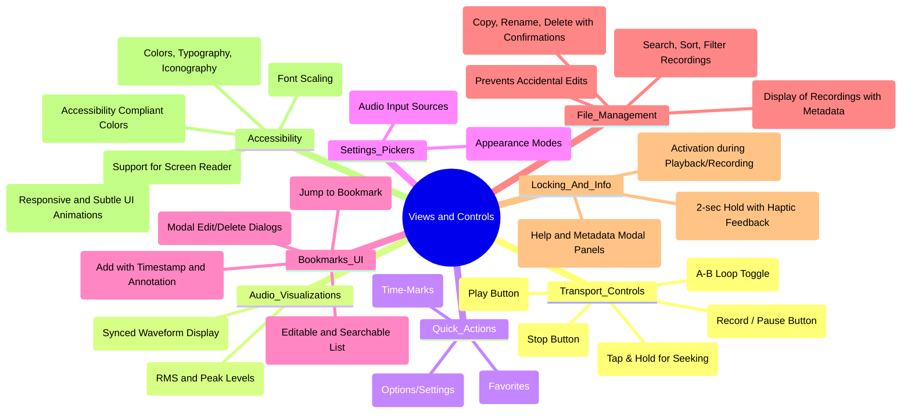
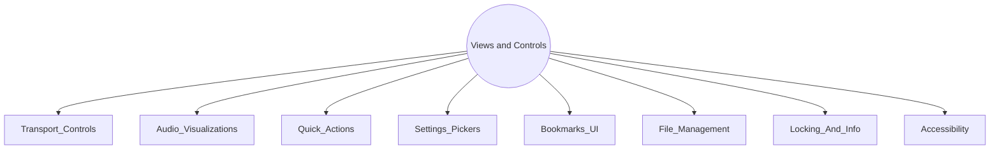

# 7. Views and Controls Mind Map (Frontend)

```mermaid
mindmap
  root((Views and Controls))
    Transport_Controls
      Record_Button(Record / Pause Button)
      Stop_Button(Stop Button)
      Play_Button(Play Button)
      Seek_Controls(Tap & Hold for Seeking)
      AB_Loop_Toggle(A-B Loop Toggle)
    Audio_Visualizations
      Audio_Meters(RMS and Peak Levels)
      Waveform_Visualization(Synced Waveform Display)
    Quick_Actions
      TimeMark_Button(Time-Marks)
      Favorites_Button(Favorites)
      Options_Button(Options/Settings)
    Settings_Pickers
      Audio_Input_Selection(Audio Input Sources)
      Appearance_Selector(Appearance Modes)
    Bookmarks_UI
      Add_Bookmark(Add with Timestamp and Annotation)
      List_Bookmarks(Editable and Searchable List)
      Edit_Delete_Bookmark(Modal Edit/Delete Dialogs)
      Bookmark_Navigation(Jump to Bookmark)
    File_Management
      Recording_List(Display of Recordings with Metadata)
      Search_Filter(Search, Sort, Filter Recordings)
      File_Actions(Copy, Rename, Delete with Confirmations)
      Locking_Overlay(Prevents Accidental Edits)
    Locking_And_Info
      Lock_Overlay(Activation during Playback/Recording)
      Unlock_Gesture(2-sec Hold with Haptic Feedback)
      Info_Panel(Help and Metadata Modal Panels)
    Accessibility
      VoiceOver(Support for Screen Reader)
      Dynamic_Type(Font Scaling)
      Color_Contrast(Accessibility Compliant Colors)
      Consistent_Styling(Colors, Typography, Iconography)
      Animation(Responsive and Subtle UI Animations)
```

## Graph

```mermaid
graph TD
  root((Views and Controls))
    root --> Transport_Controls
    root --> Audio_Visualizations
    root --> Quick_Actions
    root --> Settings_Pickers
    root --> Bookmarks_UI
    root --> File_Management
    root --> Locking_And_Info
    root --> Accessibility
```
